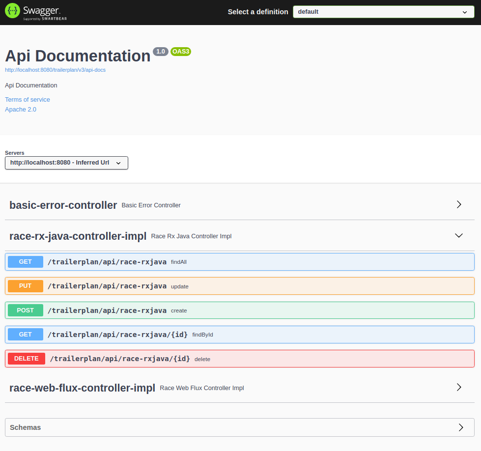
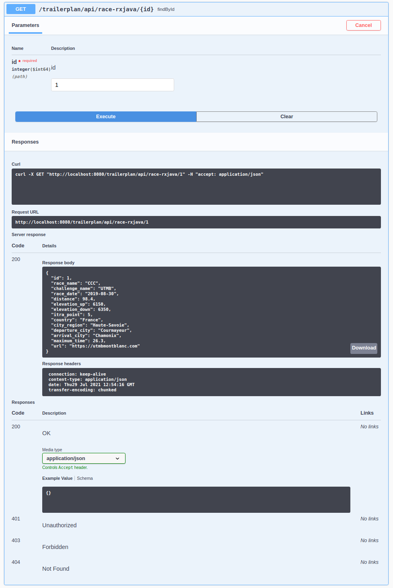
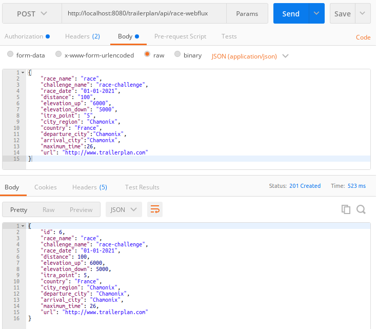

# Reactive REST API with RxJava3 and WebFlux

This is an example of Reactive REST API for the project TRAILERPLAN in https://github.com/boonsuli/trailerplan-race-api.
It manages the trail running races of this project. It use RxJava3 and Webflux but just one is enought! I just want to
know how we can implement them ;-)

It use :
--------------------------------------
- Spring boot 2.4.5
- Spring Data R2DBC 1.3.1
- RxJava3 3.0.13
- H2 1.4.200, R2DBC driver 0.8.4.RELEASE
- MariaDB 10.5.9, R2DBC driver 1.0.2
- Dozer 5.5.1
- Junit Jupiter 5.7.2
- Jackson 2.11.4
- Springfox Swagger2 3.0.0
- Logback 1.2.3
- Javax Persistence API 2.2

It use for the database, MariaDB version 10.5.9 as a docker container and H2 version 1.4.200 for integration test.

Checkout the source : https://github.com/boonsuli/trailerplan-race-api
Then build it with the ide or : 

```shell
user@host:~.../trailerplan-race-api$ mvn clean install
```

You can verify the app. Start spring boot from target. Run it with :
```shell
user@host:~.../trailerplan-race-api/target$ java -Dspring.profiles.active=dev-app-local -jar race-api-0.0.1-SNAPSHOT.jar
.   ____          _            __ _ _
/\\ / ___'_ __ _ _(_)_ __  __ _ \ \ \ \
( ( )\___ | '_ | '_| | '_ \/ _` | \ \ \ \
\\/  ___)| |_)| | | | | || (_| |  ) ) ) )
'  |____| .__|_| |_|_| |_\__, | / / / /
=========|_|==============|___/=/_/_/_/
:: Spring Boot ::                (v2.4.5)

2021-07-29 jeu. 09:59:32.879 INFO  RaceApiReactiveApplication Starting RaceApiReactiveApplication v0.0.1-SNAPSHOT using Java 11.0.10 on yoda with PID 12689 (/home/bsui/workspace/myProject-java/trailerplan-race-api/target/race-api-0.0.1-SNAPSHOT.jar started by bsui in /home/bsui/workspace/myProject-java/trailerplan-race-api/target)
2021-07-29 jeu. 09:59:32.882 DEBUG RaceApiReactiveApplication Running with Spring Boot v2.4.5, Spring v5.3.6
2021-07-29 jeu. 09:59:32.882 INFO  RaceApiReactiveApplication The following profiles are active: dev-app-local
2021-07-29 jeu. 09:59:33.661 INFO  RepositoryConfigurationDelegate Bootstrapping Spring Data R2DBC repositories in DEFAULT mode.
2021-07-29 jeu. 09:59:33.913 INFO  RepositoryConfigurationDelegate Finished Spring Data repository scanning in 248 ms. Found 2 R2DBC repository interfaces.
2021-07-29 jeu. 09:59:34.581 WARN  jsr UT026010: Buffer pool was not set on WebSocketDeploymentInfo, the default pool will be used
2021-07-29 jeu. 09:59:34.603 INFO  servlet Initializing Spring embedded WebApplicationContext
2021-07-29 jeu. 09:59:34.603 INFO  ServletWebServerApplicationContext Root WebApplicationContext: initialization completed in 1642 ms
2021-07-29 jeu. 09:59:35.787 INFO  ThreadPoolTaskExecutor Initializing ExecutorService 'applicationTaskExecutor'
2021-07-29 jeu. 09:59:35.954 INFO  undertow starting server: Undertow - 2.2.7.Final
2021-07-29 jeu. 09:59:35.964 INFO  xnio XNIO version 3.8.0.Final
2021-07-29 jeu. 09:59:35.975 INFO  nio XNIO NIO Implementation Version 3.8.0.Final
2021-07-29 jeu. 09:59:36.049 INFO  threads JBoss Threads version 3.1.0.Final
2021-07-29 jeu. 09:59:36.086 INFO  UndertowWebServer Undertow started on port(s) 8080 (http) with context path '/trailerplan'
2021-07-29 jeu. 09:59:36.132 INFO  servlet Initializing Spring DispatcherServlet 'dispatcherServlet'
2021-07-29 jeu. 09:59:36.132 INFO  DispatcherServlet Initializing Servlet 'dispatcherServlet'
2021-07-29 jeu. 09:59:36.134 INFO  DispatcherServlet Completed initialization in 2 ms
2021-07-29 jeu. 09:59:36.541 INFO  RaceApiReactiveApplication Started RaceApiReactiveApplication in 4.204 seconds (JVM running for 4.706)
```


## Containerised APP and DB
You can run it as a SpringBoot application in your favorite ide or in a docker container. The docker container for he DB
and the APP are build by docker compose.

### Container MariaDB
the command shell to build the database container is :
```shell
user@host:~.../trailerplan-race-api$ docker-compose --env-file ./docker/config/env.dev up -d mariadb
```

check if the container is create successfully and running:
```shell
user@host:~.../trailerplan-race-api$ docker ps
CONTAINER ID   IMAGE                                 COMMAND                  CREATED        STATUS       PORTS                    NAMES
4a8f51ddb3c1   mariadb:10.5.9                        "docker-entrypoint.s…"   23 hours ago   Up 2 hours   0.0.0.0:3306->3306/tcp   mariadb-container
```

check inside the container 
```shell
user@host:~.../trailerplan-race-api$ docker exec -it mariadb-container bash
root@mariadb-server:/# ls /docker-entrypoint-initdb.d
mariadb-01-schema.sql  mariadb-02-data.sql
```
It is the schema and initial data of the database.

check the logs mariadb-container
```shell
user@host:~.../trailerplan-race-api$ docker logs mariadb-container
2021-07-28 14:59:45+00:00 [Note] [Entrypoint]: Entrypoint script for MySQL Server 1:10.5.9+maria~focal started.
2021-07-28 14:59:45+00:00 [Note] [Entrypoint]: Switching to dedicated user 'mysql'
2021-07-28 14:59:45+00:00 [Note] [Entrypoint]: Entrypoint script for MySQL Server 1:10.5.9+maria~focal started.
2021-07-28 14:59:45 0 [Note] mysqld (mysqld 10.5.9-MariaDB-1:10.5.9+maria~focal) starting as process 1 ...
2021-07-28 14:59:45 0 [Note] InnoDB: Uses event mutexes
2021-07-28 14:59:45 0 [Note] InnoDB: Compressed tables use zlib 1.2.11
2021-07-28 14:59:45 0 [Note] InnoDB: Number of pools: 1
2021-07-28 14:59:45 0 [Note] InnoDB: Using crc32 + pclmulqdq instructions
2021-07-28 14:59:45 0 [Note] mysqld: O_TMPFILE is not supported on /tmp (disabling future attempts)
2021-07-28 14:59:45 0 [Note] InnoDB: Using Linux native AIO
2021-07-28 14:59:45 0 [Note] InnoDB: Initializing buffer pool, total size = 134217728, chunk size = 134217728
2021-07-28 14:59:45 0 [Note] InnoDB: Completed initialization of buffer pool
2021-07-28 14:59:45 0 [Note] InnoDB: If the mysqld execution user is authorized, page cleaner thread priority can be changed. See the man page of setpriority().
2021-07-28 14:59:45 0 [Note] InnoDB: 128 rollback segments are active.
2021-07-28 14:59:45 0 [Note] InnoDB: Creating shared tablespace for temporary tables
2021-07-28 14:59:45 0 [Note] InnoDB: Setting file './ibtmp1' size to 12 MB. Physically writing the file full; Please wait ...
2021-07-28 14:59:45 0 [Note] InnoDB: File './ibtmp1' size is now 12 MB.
2021-07-28 14:59:45 0 [Note] InnoDB: 10.5.9 started; log sequence number 52162; transaction id 45
2021-07-28 14:59:45 0 [Note] Plugin 'FEEDBACK' is disabled.
2021-07-28 14:59:45 0 [Note] InnoDB: Loading buffer pool(s) from /var/lib/mysql/ib_buffer_pool
2021-07-28 14:59:45 0 [Note] InnoDB: Buffer pool(s) load completed at 210728 14:59:45
2021-07-28 14:59:45 0 [Note] Server socket created on IP: '::'.
2021-07-28 14:59:45 0 [Warning] 'proxies_priv' entry '@% root@mariadb-server' ignored in --skip-name-resolve mode.
2021-07-28 14:59:45 0 [Note] Reading of all Master_info entries succeeded
2021-07-28 14:59:45 0 [Note] Added new Master_info '' to hash table
2021-07-28 14:59:45 0 [Note] mysqld: ready for connections.
```


### Container reactive java app 
The command shell to build the java reative app :
```shell
user@host:~.../trailerplan-race-api$ docker-compose --env-file ./docker/config/env.dev up -d app_java
```

check if the container is create successlly and running:
```shell
user@host:~.../trailerplan-race-api$ docker ps
CONTAINER ID   IMAGE                                 COMMAND                  CREATED        STATUS       PORTS                    NAMES
ae0bb78bff71   trailerplan/app_java_race-api:0.1.0   "/usr/local/openjdk-…"   4 hours ago    Up 2 hours   0.0.0.0:8080->8080/tcp   app_java-container
4a8f51ddb3c1   mariadb:10.5.9                        "docker-entrypoint.s…"   23 hours ago   Up 2 hours   0.0.0.0:3306->3306/tcp   mariadb-container
```

check inside the container
```shell
user@host:~.../trailerplan-race-api$ docker exec -it app_java-container bash
root@app_java-server:/app# ls
trailerplan-race-api.jar
```

check the logs :
```shell
user@host:~.../trailerplan-race-api$ docker logs app_java-container

  .   ____          _            __ _ _
 /\\ / ___'_ __ _ _(_)_ __  __ _ \ \ \ \
( ( )\___ | '_ | '_| | '_ \/ _` | \ \ \ \
 \\/  ___)| |_)| | | | | || (_| |  ) ) ) )
  '  |____| .__|_| |_|_| |_\__, | / / / /
 =========|_|==============|___/=/_/_/_/
 :: Spring Boot ::                (v2.4.5)

2021-07-29 Thu 13:55:15.425 INFO  RaceApiReactiveApplication Starting RaceApiReactiveApplication v0.0.1-SNAPSHOT using Java 11.0.12 on app_java-server with PID 1 (/app/trailerplan-race-api.jar started by root in /app)
2021-07-29 Thu 13:55:15.427 DEBUG RaceApiReactiveApplication Running with Spring Boot v2.4.5, Spring v5.3.6
2021-07-29 Thu 13:55:15.427 INFO  RaceApiReactiveApplication The following profiles are active: dev-app-container
2021-07-29 Thu 13:55:15.972 INFO  RepositoryConfigurationDelegate Bootstrapping Spring Data R2DBC repositories in DEFAULT mode.
2021-07-29 Thu 13:55:16.196 INFO  RepositoryConfigurationDelegate Finished Spring Data repository scanning in 221 ms. Found 2 R2DBC repository interfaces.
2021-07-29 Thu 13:55:16.691 WARN  jsr UT026010: Buffer pool was not set on WebSocketDeploymentInfo, the default pool will be used
2021-07-29 Thu 13:55:16.704 INFO  servlet Initializing Spring embedded WebApplicationContext
2021-07-29 Thu 13:55:16.704 INFO  ServletWebServerApplicationContext Root WebApplicationContext: initialization completed in 1224 ms
2021-07-29 Thu 13:55:17.527 INFO  ThreadPoolTaskExecutor Initializing ExecutorService 'applicationTaskExecutor'
2021-07-29 Thu 13:55:17.648 INFO  undertow starting server: Undertow - 2.2.7.Final
2021-07-29 Thu 13:55:17.654 INFO  xnio XNIO version 3.8.0.Final
2021-07-29 Thu 13:55:17.661 INFO  nio XNIO NIO Implementation Version 3.8.0.Final
2021-07-29 Thu 13:55:17.713 INFO  threads JBoss Threads version 3.1.0.Final
2021-07-29 Thu 13:55:17.776 INFO  UndertowWebServer Undertow started on port(s) 8080 (http) with context path '/trailerplan'
2021-07-29 Thu 13:55:18.126 INFO  RaceApiReactiveApplication Started RaceApiReactiveApplication in 3.113 seconds (JVM running for 3.489)
```

You can now check with curl, postman, swagger-ui the rest api !

#### CURL :
```shell
user@host:~.../trailerplan-race-api$ curl http://localhost:8080/trailerplan/api/race-webflux/1
{"id":1,"race_name":"CCC","challenge_name":"UTMB","race_date":"2019-08-30","distance":98.4,"elevation_up":6150,"elevation_down":6350,"itra_point":5,"country":"France","city_region":"Haute-Savoie","departure_city":"Courmayeur","arrival_city":"Chamonix","maximum_time":26.3,"url":"https://utmbmontblanc.com"}
```

#### SWAGGER-UI
The application rest api has an JSON API documentation swagger in order to inform user and testing the API.
The url is : http://localhost:8080/trailerplan/swagger-ui/index.html



______________________________________________________________________________________________________________

The rxjava get by id :<br>


______________________________________________________________________________________________________________

The WebFlux post with postman :<br>



